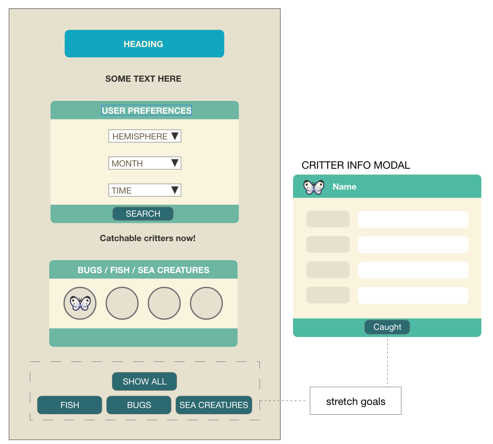

Juno College Web Development Bootcamp - Project 1

## Table of contents

- [Overview](#overview)
  - [Objective](#the-challenge)
  - [Screenshot](#screenshot)
- [My process](#my-process)
  - [Built with](#built-with)
  - [What I learned](#what-i-learned)
- [Author](#author)

## Overview

### Objective

- An app that helps an islander discover all the critters available in Animal Crossing: New Horizon

### Screenshot

### Links

- Solution URL: [Code]()
- Live Site URL: [Preview]()

## My process
- Pseudo code
- Wireframe
- Kanban
- Git & Github

- Wireframe

### Built with

- Semantic HTML5 markup
- CSS custom properties
- SCSS
- JavaScript

### What I learned

- Working with RESTful APIs
- Using the API data to dynamically create elements on the page

## Authors

Kaarina Nieminen
Christopher Leung